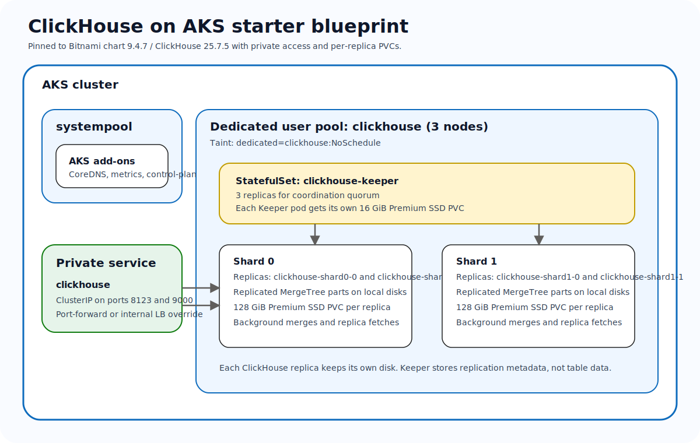

# Running ClickHouse on AKS with AKS AVM, pinned Helm values, and private access

**Publication target:** Microsoft TechCommunity > Azure > Linux and Open Source Blog

## Summary

ClickHouse is easy to launch in Kubernetes, but a reusable Azure-first deployment pattern needs more than a default Helm install. In this post, I walk through a starter blueprint for running ClickHouse on Azure Kubernetes Service (AKS) with an AKS Azure Verified Modules (AVM) baseline, a dedicated `clickhouse` node pool, internal-only service exposure, and a chart configuration that makes shards, replicas, Keeper, and per-replica storage visible in source control.

The goal is not to claim that one chart file solves every day-two problem. The goal is to give platform teams a clean starting point that already respects the realities of stateful analytical databases on AKS.

## Why ClickHouse on AKS is worth standardizing

ClickHouse fits well on AKS when teams want:

- Kubernetes-native lifecycle management for the database tier
- Azure-native cluster creation and managed identity support
- explicit stateful storage and node placement choices
- a private-by-default client access path
- source-controlled operational guidance for shards, replicas, and Keeper

The catch is that ClickHouse is not a stateless web service. It writes data to local MergeTree parts, merges those parts in the background, coordinates replicas through Keeper, and needs a predictable storage story per replica.

## Why this is not a typical AKS microservice

This is the point worth making early: **ClickHouse on AKS is not a generic microservice deployment**.

Typical microservices often look like this:

- a `Deployment`
- interchangeable replicas
- little or no persistent per-pod storage
- state stored elsewhere

ClickHouse is different:

- each shard is deployed as a **StatefulSet**
- each replica keeps its own **PVC-backed disk**
- **ClickHouse Keeper** maintains replication metadata and quorum
- **background merges** constantly rewrite local data parts, so disk shape and headroom matter
- `kubectl get pvc` is a real readiness check, not an optional extra

That is why the checked-in blueprint focuses on dedicated node pools, Premium SSD storage, runtime secret creation through `existingSecret`, and private access from the start.

## What the repo now provides

The ClickHouse workload in the repo is organized around five practical building blocks:

1. a shared AKS baseline under `platform/aks-avm`
2. workload wrappers for Terraform and Bicep under `workloads/olap-databases/clickhouse/infra`
3. deployment guidance for portal-first and CLI-first operators under `workloads/olap-databases/clickhouse/docs`
4. Helm values and Kubernetes manifests under `workloads/olap-databases/clickhouse/kubernetes`
5. publish-ready blog assets under `blogs/clickhouse`

That split keeps the platform baseline reusable while still letting the database blueprint own the parts that make ClickHouse operationally distinct.

## The target architecture



*The starter blueprint uses one dedicated `clickhouse` user pool with three nodes, a `2 shards × 2 replicas` ClickHouse topology, a three-node Keeper quorum, and per-replica Premium SSD storage.*

| Layer | Recommendation | Why |
| --- | --- | --- |
| AKS baseline | Shared AVM wrapper | Keeps cluster creation consistent across workloads |
| Dedicated pool | `clickhouse` user pool with 3 nodes | Isolates OLAP I/O and merge activity |
| ClickHouse topology | 2 shards × 2 replicas | Gives a concrete distributed starter topology |
| Keeper | 3 replicas | Preserves replication coordination quorum |
| Service exposure | `ClusterIP` only by default | Keeps the database surface private |
| Storage | Premium SSD PVC per replica | Better fit for MergeTree data and Keeper metadata |
| Authentication | `existingSecret` | Avoids fake admin passwords in source control |

## Step 1: Deploy or align the AKS baseline

The repo keeps both IaC options visible because different teams standardize differently.

### Bicep path

```bash
export LOCATION=eastus
export RESOURCE_GROUP=rg-clickhouse-aks-dev
export CLUSTER_NAME=aks-clickhouse-dev

az group create --name "$RESOURCE_GROUP" --location "$LOCATION"

az deployment group create --resource-group "$RESOURCE_GROUP" --template-file workloads/olap-databases/clickhouse/infra/bicep/main.bicep --parameters clusterName="$CLUSTER_NAME" location="$LOCATION"
```

### Terraform path

```bash
cd workloads/olap-databases/clickhouse/infra/terraform
cp terraform.tfvars.example terraform.tfvars

terraform init
terraform plan
terraform apply
```

Both wrappers create `systempool` plus a dedicated `clickhouse` user pool with three nodes and the `dedicated=clickhouse:NoSchedule` taint.

## Step 2: Prepare storage, namespace, and the runtime secret

Once the cluster is ready, connect to it and apply the small Kubernetes-native assets that sit beside the chart:

```bash
az aks get-credentials --resource-group "$RESOURCE_GROUP" --name "$CLUSTER_NAME"

kubectl apply -f workloads/olap-databases/clickhouse/kubernetes/manifests/managed-csi-premium-storageclass.yaml
kubectl apply -f workloads/olap-databases/clickhouse/kubernetes/manifests/namespace.yaml

kubectl create secret generic clickhouse-auth --namespace clickhouse --from-literal=admin-password="$(openssl rand -base64 32 | tr -d '\n')"
```

That secret is important. The checked-in values use `auth.existingSecret`, so the repo never needs to carry a fake admin password.

## Step 3: Install the pinned chart

```bash
helm repo add bitnami https://charts.bitnami.com/bitnami
helm repo update

helm upgrade --install clickhouse bitnami/clickhouse --version 9.4.7 --namespace clickhouse --values workloads/olap-databases/clickhouse/kubernetes/helm/clickhouse-values.yaml
```

The checked-in values do four important things:

1. keep the service private by default
2. define a real shard and replica layout
3. enable a three-node Keeper quorum
4. bind ClickHouse and Keeper to Premium SSD-backed PVCs

## Step 4: Validate the cluster privately

I like to validate both Kubernetes health and ClickHouse topology, because successful pod creation alone does not prove the replica story is healthy.

```bash
kubectl get statefulset,pods,pvc,svc -n clickhouse
export CLICKHOUSE_PASSWORD=$(kubectl get secret clickhouse-auth -n clickhouse -o jsonpath='{.data.admin-password}' | base64 --decode)

kubectl port-forward svc/clickhouse 8123:8123 9000:9000 -n clickhouse
curl http://127.0.0.1:8123/ping
curl --user default:$CLICKHOUSE_PASSWORD "http://127.0.0.1:8123/?query=SELECT%20version()"
curl --user default:$CLICKHOUSE_PASSWORD "http://127.0.0.1:8123/?query=SELECT%20cluster%2Cshard_num%2Creplica_num%2Chost_name%20FROM%20system.clusters%20WHERE%20cluster%3D%27aks-clickhouse%27%20FORMAT%20PrettyCompact"
```

For this workload, the PVC check is critical. Each ClickHouse replica and each Keeper replica needs a bound disk before the rollout is trustworthy.

## Where the AKS-specific decisions matter

The Azure-specific value of this blueprint is not just that it deploys ClickHouse on Kubernetes. It is the combination of AKS decisions around:

- a reusable AVM cluster baseline
- dedicated placement for stateful OLAP pods
- source-controlled storage and secret handling
- private access by default
- an upgrade path that already acknowledges Keeper quorum and per-replica disks

The checked-in package intentionally stops short of provisioning backup storage. When you add Azure Blob-backed backup tooling or object-store-integrated engines later, keep the auth model on workload identity and managed identity rather than storage account keys.

## Final thoughts

ClickHouse is powerful precisely because it is opinionated about local storage, MergeTree behavior, and replicated analytical scale. A useful AKS blueprint should be equally opinionated about node pools, PVCs, private access, and secret handling. This starter package is meant to give teams that first real contract: one shared AKS baseline, one dedicated OLAP pool, a concrete shard and replica topology, and documentation that treats day-two operations as part of the design instead of a future surprise.
