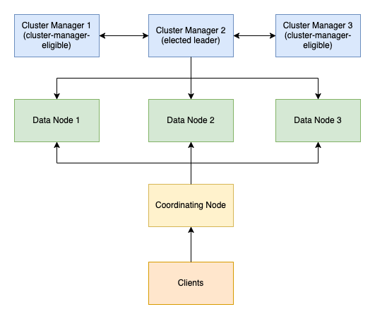
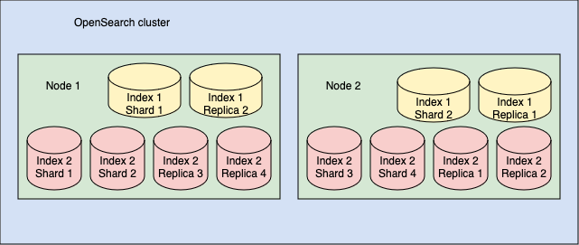
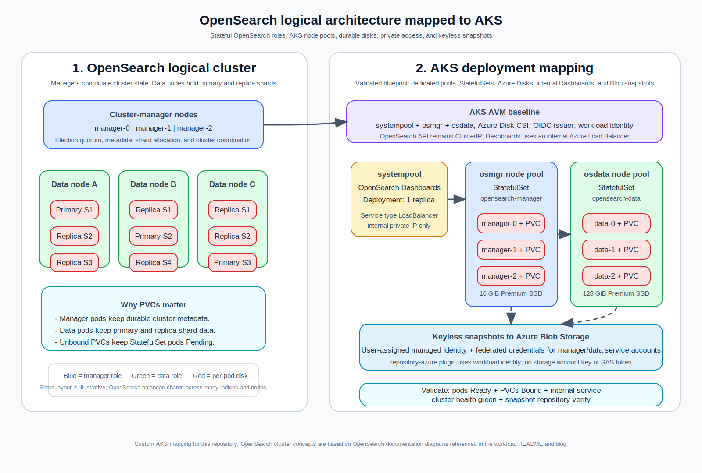

# Deploying OpenSearch on AKS with AKS AVM, Helm, and internal Dashboards

**Publication target:** Microsoft TechCommunity > Azure > Linux and Open Source Blog

## Summary

OpenSearch is easy to demo on Kubernetes, but getting to a reusable Azure-first deployment pattern takes a little more discipline. In this post, I will walk through a starter blueprint for running OpenSearch on Azure Kubernetes Service (AKS) with an AKS Azure Verified Modules (AVM) baseline, separate Helm releases for manager and data nodes, and an internal-only access pattern for Dashboards and the OpenSearch API.

The goal is not to claim a one-click production deployment. The goal is to create a clean, repeatable foundation that platform teams can evolve into a production-ready operating model without starting from a throwaway lab.

## Why OpenSearch on AKS is worth standardizing

OpenSearch is a strong fit when teams want a Kubernetes-native search and analytics platform but still want Azure-native control around:

- cluster creation
- managed identity and networking
- storage choices
- operational visibility
- internal versus external access

The challenge is that OpenSearch is not just another stateless app. It has persistent shard storage, JVM heap requirements, disk pressure behavior, cluster elections, recovery flows, and backup expectations. So a reusable AKS pattern needs to cover more than `helm install`.

## Why this is not a typical AKS microservice

This is the part I want readers to notice early: **OpenSearch on AKS is not a normal stateless microservice deployment**.

Typical AKS microservices often look like this:

- a `Deployment`
- replicas that can restart almost anywhere
- little or no persistent per-pod storage
- durable state kept in some other service

OpenSearch is different:

- manager and data tiers run as **StatefulSets**
- each **manager pod needs its own disk** for cluster metadata durability
- each **data pod needs its own disk** for shard storage, relocation, and recovery
- a missing or unbound **PersistentVolumeClaim (PVC)** will block pod startup

That is why OpenSearch validation on AKS must include `kubectl get pvc`, not just `kubectl get pods`.

## OpenSearch architecture before the AKS mapping

These official diagrams are helpful because they explain the underlying OpenSearch model before I add the Azure and AKS-specific choices.



*Source: [OpenSearch documentation cluster architecture diagram](https://docs.opensearch.org/latest/images/cluster.png), OpenSearch Contributors, Apache License 2.0.*



*Source: [OpenSearch documentation shard and replica diagram](https://docs.opensearch.org/latest/images/intro/cluster-replicas.png), OpenSearch Contributors, Apache License 2.0.*

## What this repo now provides

The OpenSearch workload in the repo is organized around five practical building blocks:

1. a shared AKS baseline under `platform/aks-avm`
2. workload wrappers for Terraform and Bicep under `workloads/search-analytics/opensearch/infra`
3. deployment guidance for portal-first and CLI-first operators under `workloads/search-analytics/opensearch/docs`
4. Helm values and Kubernetes manifests under `workloads/search-analytics/opensearch/kubernetes`
5. publish-ready blog assets under `blogs/opensearch`

That split is intentional. It keeps AKS platform concerns reusable while still letting the workload carry its own installation and operational guidance.

## Checked-in version contract

These are the repo-backed versions this walkthrough currently matches.

| Component | Checked-in version | Evidence in repo |
| --- | --- | --- |
| Manager and data charts | `opensearch/opensearch` `3.6.0` | `workloads/search-analytics/opensearch/kubernetes/helm/README.md` |
| Dashboards chart | `opensearch/opensearch-dashboards` `3.6.0` | `workloads/search-analytics/opensearch/kubernetes/helm/README.md` |

The checked-in values intentionally inherit runtime images from those chart defaults, so the chart version is the most concrete repo-backed contract to revalidate before publication.


## The target architecture

For the first opinionated OpenSearch blueprint in this repo, I am using this starting pattern:



*Custom AKS mapping for this repository. It combines OpenSearch cluster roles, shard/replica behavior, dedicated AKS node pools, StatefulSets, and per-pod PVC-backed Azure Disks.*

| Layer | Recommendation | Why |
| --- | --- | --- |
| AKS baseline | Shared AVM wrapper | Keeps cluster creation consistent across workloads |
| Manager tier | Dedicated Helm release | Protects elections and cluster metadata |
| Data tier | Dedicated Helm release | Isolates shard-heavy indexing and storage I/O |
| OpenSearch API | `ClusterIP` only | Reduces exposure of the core service |
| Dashboards | Internal Azure load balancer | Gives operators access without making the API public |
| Persistent storage | Azure Disk CSI Premium SSD | Good default for durable stateful workloads |
| Snapshots | Azure Blob Storage | Provides an external recovery target |

The standard Helm release names in the blueprint are:

- `opensearch-manager`
- `opensearch-data`
- `opensearch-dashboards`

This matters because the Helm values and service discovery examples assume those names.

## Prerequisites

Before you start, make sure you have:

- an Azure subscription with AKS and managed disk quota
- Azure CLI installed and logged in
- `kubectl` installed
- Helm 3.x installed
- Terraform 1.11+ if you want the Terraform path
- a globally unique storage account name if you want to create snapshot storage from the example wrappers

## Step 1: Deploy or align the AKS baseline

This repo keeps both IaC options visible because different teams standardize differently.

### Bicep path

```bash
export LOCATION=eastus
export RESOURCE_GROUP=rg-opensearch-aks-dev
export CLUSTER_NAME=aks-opensearch-dev
export SNAPSHOT_STORAGE_ACCOUNT=opssnapdev001

az group create \
  --name "$RESOURCE_GROUP" \
  --location "$LOCATION"

az deployment group create \
  --resource-group "$RESOURCE_GROUP" \
  --template-file workloads/search-analytics/opensearch/infra/bicep/main.bicep \
  --parameters \
      clusterName="$CLUSTER_NAME" \
      location="$LOCATION" \
      snapshotStorageAccountName="$SNAPSHOT_STORAGE_ACCOUNT"
```

### Terraform path

```bash
cd workloads/search-analytics/opensearch/infra/terraform
cp terraform.tfvars.example terraform.tfvars

terraform init
terraform plan
terraform apply
```

The current wrappers focus on the AKS baseline and a starter snapshot storage account. They are designed to be a strong repo contract, not a claim that every day-2 detail is already automated.
When snapshot storage is enabled, the wrappers also turn on the AKS OIDC issuer and workload identity features, create a user-assigned managed identity plus federated credentials for the OpenSearch snapshot service accounts, and disable shared-key access on the starter storage account.
The checked-in wrappers provision `systempool`, `osmgr`, and `osdata`. The dedicated `osmgr` and `osdata` pools start with three nodes each so the default manager and data replicas can satisfy their hard anti-affinity rules.

## Step 2: Connect to AKS and create the namespace

Once the cluster is ready, connect to it and create the dedicated namespace:

```bash
az aks get-credentials \
  --resource-group "$RESOURCE_GROUP" \
  --name "$CLUSTER_NAME"

kubectl apply -f workloads/search-analytics/opensearch/kubernetes/manifests/managed-csi-premium-storageclass.yaml
kubectl apply -f workloads/search-analytics/opensearch/kubernetes/manifests/namespace.yaml
```

If you kept snapshot storage enabled, capture the snapshot managed identity client ID from your deployment outputs because the Helm install uses it to annotate the workload-identity service accounts.

## Step 3: Create the bootstrap secrets

The blueprint ships example secret manifests for:

- the initial OpenSearch admin password
- the Dashboards username, password, and cookie secret

Treat those YAML files as templates only. Create real secrets instead of applying the example manifests unchanged:

```bash
kubectl create secret generic opensearch-admin-credentials \
  --namespace opensearch \
  --from-literal=password='<strong-admin-password>' \
  --dry-run=client -o yaml | kubectl apply -f -

kubectl create secret generic opensearch-dashboards-auth \
  --namespace opensearch \
  --from-literal=username='admin' \
  --from-literal=password='<strong-admin-password>' \
  --from-literal=cookie='<32-character-cookie-secret>' \
  --dry-run=client -o yaml | kubectl apply -f -
```

## Step 4: Install the manager tier

This blueprint uses a separate release for manager nodes. The surrounding docs use cluster-manager language, but the current Helm chart still uses `masterService` and `master` role naming in its values.

```bash
export OPENSEARCH_HELM_VERSION=3.6.0
export SNAPSHOT_IDENTITY_CLIENT_ID=<snapshot-managed-identity-client-id>

helm repo add opensearch https://opensearch-project.github.io/helm-charts/
helm repo update

helm upgrade --install opensearch-manager opensearch/opensearch \
  --version "$OPENSEARCH_HELM_VERSION" \
  --namespace opensearch \
  --set-string rbac.serviceAccountAnnotations.azure\\.workload\\.identity/client-id="$SNAPSHOT_IDENTITY_CLIENT_ID" \
  --values workloads/search-analytics/opensearch/kubernetes/helm/manager-values.yaml
```

The manager values focus on:

- three manager replicas
- Premium SSD-backed PVCs
- hard anti-affinity
- optional node-pool targeting for an `osmgr` AKS pool
- `repository-azure` plus `azure.client.default.token_credential_type: managed_identity` for the keyless snapshot path

## Step 5: Install the data tier

The data release joins the same cluster and points back to the manager service for discovery:

```bash
helm upgrade --install opensearch-data opensearch/opensearch \
  --version "$OPENSEARCH_HELM_VERSION" \
  --namespace opensearch \
  --set-string rbac.serviceAccountAnnotations.azure\\.workload\\.identity/client-id="$SNAPSHOT_IDENTITY_CLIENT_ID" \
  --values workloads/search-analytics/opensearch/kubernetes/helm/data-values.yaml
```

The data values raise storage and JVM sizing relative to the manager tier and are intended for a dedicated `osdata` node pool.

## Step 6: Install Dashboards with internal-only exposure

```bash
helm upgrade --install opensearch-dashboards opensearch/opensearch-dashboards \
  --version "$OPENSEARCH_HELM_VERSION" \
  --namespace opensearch \
  --values workloads/search-analytics/opensearch/kubernetes/helm/dashboards-values.yaml
```

The Dashboards values do two important things:

1. they point Dashboards at the internal OpenSearch service
2. they configure the service as an **internal** Azure load balancer

That is a much better default than exposing the OpenSearch API publicly.

## Step 7: Validate the deployment

At minimum, validate the pod set, PVC bindings, and service shape:

```bash
kubectl get pods -n opensearch
kubectl get pvc -n opensearch
kubectl get svc -n opensearch
kubectl describe svc opensearch-dashboards -n opensearch
```

For this workload, the PVC check is not just nice to have. The manager and data pods each depend on their own Azure Disk-backed PVC, so `kubectl get pvc` needs to show every claim as `Bound` before you can trust the rollout.

For API validation without public exposure, use port-forward:

```bash
kubectl port-forward svc/opensearch-manager 9200:9200 -n opensearch
curl -k https://127.0.0.1:9200
```

## Why I like this starting pattern

It gives teams a cleaner path than an all-in-one Helm demo:

- cluster creation is tied back to a shared AVM baseline
- manager and data responsibilities are separated early
- storage and access choices are visible in source control
- the same repo supports portal-first and CLI-first operators
- the implementation assets are close enough to the blog content that they can evolve together

## What comes next

This first post gets OpenSearch running on AKS with a cleaner Azure-first blueprint. The next question is what changes when the workload needs to behave like a durable platform rather than a demo.

That is the focus of Part 2: dedicated node pools, disk headroom, private access, snapshots, observability, and day-2 operations.
