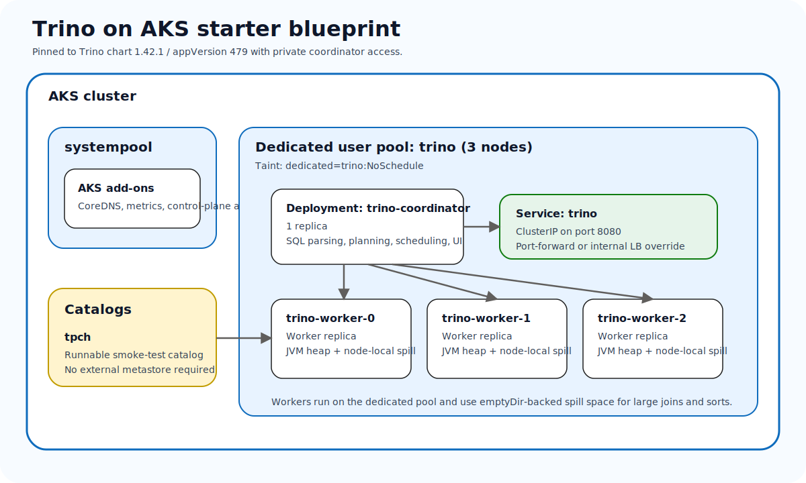

# Running Trino on AKS with AKS AVM, Helm, and a private SQL endpoint

**Publication target:** Microsoft TechCommunity > Azure > Linux and Open Source Blog

## Summary

Trino is one of the fastest ways to turn a Kubernetes cluster into a distributed SQL engine, but the jump from a demo to a reusable Azure-first blueprint is bigger than a single `helm install`. In this post, I walk through a starter pattern for running Trino on Azure Kubernetes Service (AKS) with an AKS Azure Verified Modules (AVM) baseline, a dedicated `trino` node pool, private-by-default service exposure, and a concrete `tpch` catalog so the cluster is usable on day one.

The goal is not to pretend every production concern is solved. The goal is to give platform teams a clean starter blueprint that does not collapse into a lab-only setup the moment query memory, node placement, or catalog onboarding starts to matter.

## Why Trino on AKS is worth standardizing

Trino fits well on AKS when teams want:

- Kubernetes-native lifecycle management
- Azure-native cluster creation and managed identity options
- repeatable node-pool placement for coordinator and workers
- a clear contract for connector and catalog rollout
- private access patterns for an internal query endpoint

The challenge is that Trino is not just another stateless microservice with a few more replicas. The coordinator and worker roles are different, memory settings matter, large joins can spill to disk, and catalogs are part of the runtime design rather than an optional afterthought.

## Why this is not a typical AKS microservice

This is the point I want readers to notice early: **Trino on AKS is not a generic HTTP service**.

A typical microservice might look like this:

- one pod type
- a public or internal service
- horizontal replicas with mostly interchangeable behavior
- durable state stored elsewhere

Trino is different:

- the **coordinator** parses SQL, plans stages, schedules work, and tracks cluster health
- the **workers** execute scans, joins, aggregations, and data exchange
- query success depends on **heap sizing, query memory limits, and spill-to-disk settings**
- **catalog files** define what data the engine can actually reach

That is why the checked-in blueprint keeps the service private by default, pins memory settings, uses a dedicated node pool, and ships a starter `tpch` catalog.

## What the repo now provides

The Trino workload in the repo is organized around five practical building blocks:

1. a shared AKS baseline under `platform/aks-avm`
2. workload wrappers for Terraform and Bicep under `workloads/query-engines/trino/infra`
3. deployment guidance for portal-first and CLI-first operators under `workloads/query-engines/trino/docs`
4. Helm values and namespace assets under `workloads/query-engines/trino/kubernetes`
5. publish-ready blog assets under `blogs/trino`

That split is intentional. It keeps the AKS platform baseline reusable while still letting the Trino workload own its chart values, query-engine guidance, and validation commands.

## The target architecture



*The starter blueprint uses one dedicated `trino` user pool with three nodes, a single coordinator, three workers, a private `ClusterIP` service, and a `tpch` catalog for smoke testing.*

| Layer | Recommendation | Why |
| --- | --- | --- |
| AKS baseline | Shared AVM wrapper | Keeps cluster creation consistent across workloads |
| Dedicated pool | `trino` user pool with 3 nodes | Separates distributed query work from AKS system pods |
| Coordinator | 1 replica | Preserves planning and scheduling capacity |
| Workers | 3 replicas | Gives predictable parallelism and matches the node count |
| Service exposure | `ClusterIP` only by default | Keeps the SQL endpoint private |
| Catalog | `tpch` | Makes the blueprint runnable without external data systems |
| Spill path | worker `emptyDir` volume | Handles large-memory queries more safely |

## Step 1: Deploy or align the AKS baseline

The repo keeps both IaC options visible because different teams standardize differently.

### Bicep path

```bash
export LOCATION=eastus
export RESOURCE_GROUP=rg-trino-aks-dev
export CLUSTER_NAME=aks-trino-dev

az group create --name "$RESOURCE_GROUP" --location "$LOCATION"

az deployment group create --resource-group "$RESOURCE_GROUP" --template-file workloads/query-engines/trino/infra/bicep/main.bicep --parameters clusterName="$CLUSTER_NAME" location="$LOCATION"
```

### Terraform path

```bash
cd workloads/query-engines/trino/infra/terraform
cp terraform.tfvars.example terraform.tfvars

terraform init
terraform plan
terraform apply
```

Both wrappers create `systempool` plus a dedicated `trino` user pool with three nodes and the `dedicated=trino:NoSchedule` taint.

## Step 2: Connect to AKS and install Trino

Once the cluster is ready, connect to it and create the namespace:

```bash
az aks get-credentials --resource-group "$RESOURCE_GROUP" --name "$CLUSTER_NAME"

kubectl apply -f workloads/query-engines/trino/kubernetes/manifests/namespace.yaml
```

Then install Trino with the pinned chart version:

```bash
helm repo add trino https://trinodb.github.io/charts/
helm repo update

helm upgrade --install trino trino/trino --version 1.42.1 --namespace trino --values workloads/query-engines/trino/kubernetes/helm/trino-values.yaml
```

The checked-in values do three important things:

1. keep the coordinator service on `ClusterIP`
2. keep the catalog surface to `tpch`
3. configure worker spill space on `emptyDir` so large joins and sorts have a defined path to disk

## Step 3: Validate with the `tpch` catalog

I like the `tpch` catalog here because it proves the cluster works without needing an external metastore, lakehouse, or data warehouse first.

```bash
kubectl get deploy,pods,svc -n trino

kubectl exec deploy/trino-coordinator -n trino -- trino --execute "SHOW CATALOGS"

kubectl exec deploy/trino-coordinator -n trino -- trino --execute "SELECT count(*) AS nations FROM tpch.tiny.nation"
```

For private access validation from an operator workstation:

```bash
kubectl port-forward svc/trino 8080:8080 -n trino
curl http://127.0.0.1:8080/v1/info
```

If a team needs multi-user access inside a private network, the better override is an **internal** Azure load balancer, not a public endpoint.

## Where the AKS-specific decisions matter

The Azure-specific value of this blueprint is not just “Trino on Kubernetes.” It is the combination of AKS decisions around:

- a reusable AVM cluster baseline
- node-pool isolation for distributed query work
- private-by-default service exposure
- source-controlled Helm values for memory and spill settings
- a clean path for future Azure Storage-backed catalogs via managed identity

That last point is especially important. The starter blueprint intentionally stops at `tpch`, but the next real step for many teams is Iceberg or Hive on Azure Storage. When that happens, the repo guidance is explicit: use workload identity and managed identity-based storage access, not shared keys embedded in catalog files.

## Final thoughts

Trino is easy to demo. What teams usually need is something a little more durable than a demo and a lot less opinionated than a one-off bespoke platform build. This AKS starter blueprint is meant to sit in that middle ground: one dedicated query pool, one private coordinator service, one runnable catalog, and enough documentation to move cleanly from portal validation to source-controlled deployment.
