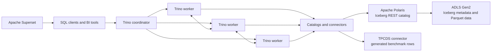

# Getting started with Trino on AKS with AKS AVM, Iceberg, and Superset

**Publication target:** Microsoft TechCommunity > Azure > Linux and Open Source Blog

## Summary

Trino is a distributed SQL query engine that lets you query data where it lives. On Kubernetes, it is easy to start with a single Helm command, but a useful Azure deployment needs more than a default chart install. You need an AKS baseline, node-pool placement, private access, storage identity, a table catalog, and a way for users to validate real persisted data.

This post walks through a starter pattern for running Trino on Azure Kubernetes Service (AKS) with an AKS Azure Verified Modules (AVM) baseline. The flow deploys the Azure foundation first, then uses Helm and Kubernetes-native steps to install Trino, Apache Polaris as an Iceberg REST catalog, ADLS Gen2 as the lakehouse storage layer, and Apache Superset as a BI client.

The goal is not to hide the interesting work behind a single opaque installer. The goal is to give platform teams a repeatable baseline and show the exact steps that turn that baseline into a working Trino lakehouse.

## What we are building

The deployment has two layers:

1. **Azure baseline:** AKS, node pools, ADLS Gen2, managed identity, workload identity federation, and Azure Database for PostgreSQL Flexible Server.
2. **Kubernetes workload setup:** Apache Polaris, Trino, TPCDS materialization into Iceberg, and Apache Superset.

That split is intentional. In this blog, a "Deploy to Azure" button should provision only the Azure baseline. The Trino, Polaris, TPCDS, and Superset steps stay in the article so readers can see the Helm values, catalog bootstrap, and validation commands.

The end-to-end flow is:

1. Deploy the Azure baseline with AKS AVM.
2. Connect to the AKS cluster.
3. Install Apache Polaris with PostgreSQL-backed metadata.
4. Bootstrap a Polaris realm, catalog, Trino principal, and role grants.
5. Install Trino with the TPCDS source catalog and Iceberg REST catalog.
6. Materialize selected TPCDS SF1 tables into Iceberg on ADLS Gen2.
7. Install Apache Superset and connect it to Trino.
8. Validate with SQL, ADLS file listings, and a Superset query.

## Architecture

The official Trino documentation describes Trino as a distributed engine where a coordinator parses SQL, creates a distributed query plan, schedules work, and workers execute tasks over splits from connectors. The key concepts are documented in the [Trino query execution model](https://trino.io/docs/current/overview/concepts.html), including statements, queries, stages, tasks, splits, drivers, operators, and exchanges. The current Trino docs page is the official source for the concepts below; the diagram is a simplified rendering of that model for this AKS deployment.

At a high level, that architecture looks like this:


```mermaid
flowchart LR
    Client[SQL clients and BI tools]
    Coordinator[Trino coordinator]
    Worker1[Trino worker]
    Worker2[Trino worker]
    Worker3[Trino worker]
    Catalogs[Catalogs and connectors]
    Polaris[Apache Polaris<br/>Iceberg REST catalog]
    ADLS[ADLS Gen2<br/>Iceberg metadata and Parquet data]
    TPCDS[TPCDS connector<br/>generated benchmark rows]
    Superset[Apache Superset]

    Superset --> Client
    Client --> Coordinator
    Coordinator --> Worker1
    Coordinator --> Worker2
    Coordinator --> Worker3
    Worker1 <--> Worker2
    Worker2 <--> Worker3
    Worker1 --> Catalogs
    Worker2 --> Catalogs
    Worker3 --> Catalogs
    Catalogs --> TPCDS
    Catalogs --> Polaris
    Polaris --> ADLS
```

The Azure deployment maps those Trino roles onto AKS node pools and Azure-managed services:


| Layer | Choice in this blueprint | Why |
| --- | --- | --- |
| AKS baseline | AKS AVM wrapper | Keeps cluster creation consistent and source-controlled |
| Trino placement | dedicated `trino` node pool | Separates distributed query work from system and catalog pods |
| Catalog service | dedicated `catalog` node pool | Keeps Polaris and metadata services isolated from query workers |
| BI layer | optional `superset` node pool | Lets BI workloads scale independently from Trino workers |
| Durable table format | Apache Iceberg | Gives persisted tables, snapshots, metadata, and open table layout |
| Catalog implementation | Apache Polaris / Iceberg REST | Avoids a Hive metastore dependency and gives a production-style REST catalog path |
| Storage | ADLS Gen2 with hierarchical namespace | Stores Iceberg metadata and Parquet data with Azure-native identity |
| Authentication | managed identity and workload identity | Avoids storage account keys and shared-key authentication |
| Validation data | Trino `tpcds` connector materialized to Iceberg | Generates benchmark data without downloading files, then persists it to ADLS |

## Prerequisites

You need:

- Azure CLI
- `kubectl`
- Helm 3.x
- OpenSSL for local secret generation
- an Azure subscription with quota for the selected AKS VM sizes
- permission to create AKS, managed identity, role assignments, ADLS Gen2 storage, and Azure Database for PostgreSQL Flexible Server
- a local clone of the repo

The examples use Sweden Central because that region often has better VM-family capacity for this workload:

```bash
export LOCATION=swedencentral
export RESOURCE_GROUP=rg-trino-aks-sdc-dev
export CLUSTER_NAME=aks-trino-sdc-dev
export TRINO_HELM_VERSION=1.42.1
export POLARIS_HELM_VERSION=1.5.0
export SUPERSET_HELM_VERSION=0.15.5
```

Select your subscription:

```bash
az account set --subscription "<subscription-name-or-id>"
az account show --query "{name:name,id:id,tenantId:tenantId}" -o table
```

## Step 1: Deploy the Azure baseline

The blog should use a "Deploy to Azure" button for the baseline when the portal template is published. The button should point to a compiled ARM template that provisions infrastructure only, similar to the baseline-first pattern used by the OpenSearch blog in this repo.

The baseline provisions:

- ADLS Gen2 storage with hierarchical namespace enabled
- a user-assigned managed identity for lakehouse access
- workload identity federation for the Trino and Polaris service accounts
- AKS through the AKS AVM wrapper
- `systempool`, `trino`, and `catalog` node pools
- optionally a `superset` node pool for the BI layer
- Azure Database for PostgreSQL Flexible Server for Polaris metadata

Until the portal template is published, use the Bicep path:

```bash
az group create \
  --name "$RESOURCE_GROUP" \
  --location "$LOCATION"

POLARIS_POSTGRES_PASSWORD="$(openssl rand -base64 32 | tr -d '\n')"

az deployment group create \
  --resource-group "$RESOURCE_GROUP" \
  --template-file workloads/query-engines/trino/infra/bicep/main.bicep \
  --parameters \
      clusterName="$CLUSTER_NAME" \
      location="$LOCATION" \
      polarisPostgreSqlAdminPassword="$POLARIS_POSTGRES_PASSWORD"
```

Capture the outputs that are needed later:

```bash
az deployment group show \
  --resource-group "$RESOURCE_GROUP" \
  --name main \
  --query properties.outputs \
  -o json
```

You need these values:

- storage account name
- lakehouse filesystem name
- lakehouse managed identity client ID
- PostgreSQL admin login
- PostgreSQL JDBC URL

## Step 2: Connect to AKS

Install or confirm `kubectl`, `kubelogin`, and Helm on your workstation:

```bash
kubectl version --client
kubelogin --version
helm version --short
```

Get cluster credentials:

```bash
az aks get-credentials \
  --resource-group "$RESOURCE_GROUP" \
  --name "$CLUSTER_NAME" \
  --overwrite-existing
```

Validate the node pools:

```bash
kubectl get nodes -L agentpool
```

You should see nodes in pools similar to:

```text
systempool
trino
catalog
```

If you plan to deploy Superset into the same AKS cluster, add or confirm a `superset` node pool. The repo also keeps Superset deployable independently under `workloads/bi/apache-superset`.

## Step 3: Install Apache Polaris as the Iceberg REST catalog

Create the namespace and PostgreSQL connection secret:

```bash
kubectl apply -f workloads/query-engines/trino/kubernetes/iceberg-rest-catalog/namespace.yaml

kubectl create secret generic polaris-postgresql -n iceberg-catalog \
  --from-literal=username="polarisadmin" \
  --from-literal=password="$POLARIS_POSTGRES_PASSWORD" \
  --from-literal=jdbcUrl="<polaris-postgresql-jdbc-url>"
```

Install Polaris with the checked-in values. Replace the workload identity placeholder before applying:

```bash
cp workloads/query-engines/trino/kubernetes/iceberg-rest-catalog/polaris-values.example.yaml /tmp/polaris-values.yaml

sed -i.bak \
  "s/<lakehouse-identity-client-id>/<lakehouse-managed-identity-client-id>/g" \
  /tmp/polaris-values.yaml

helm repo add apache-polaris https://downloads.apache.org/polaris/helm-chart/
helm repo update

helm upgrade --install polaris apache-polaris/polaris \
  --version "$POLARIS_HELM_VERSION" \
  --namespace iceberg-catalog \
  --values /tmp/polaris-values.yaml

kubectl rollout status deploy/polaris -n iceberg-catalog --timeout=5m
```

Bootstrap the Polaris realm and root principal. Keep the secret out of source control:

```bash
POLARIS_ROOT_CLIENT_SECRET="$(openssl rand -base64 48 | tr -d '\n')"

kubectl create secret generic polaris-bootstrap -n iceberg-catalog \
  --from-literal=POLARIS_BOOTSTRAP_CREDENTIALS="POLARIS,root,$POLARIS_ROOT_CLIENT_SECRET"

kubectl delete job polaris-bootstrap-admin -n iceberg-catalog --ignore-not-found=true

kubectl apply -f - <<EOF
apiVersion: batch/v1
kind: Job
metadata:
  name: polaris-bootstrap-admin
  namespace: iceberg-catalog
spec:
  backoffLimit: 0
  template:
    spec:
      restartPolicy: Never
      containers:
      - name: admin
        image: apache/polaris-admin-tool:${POLARIS_HELM_VERSION}
        command: ["/bin/sh", "-c"]
        args:
        - >-
          java -jar /deployments/polaris-admin-tool.jar
          bootstrap
          -r POLARIS
          -c POLARIS,root,$POLARIS_ROOT_CLIENT_SECRET
        env:
        - name: polaris.persistence.type
          value: relational-jdbc
        - name: quarkus.datasource.username
          valueFrom:
            secretKeyRef:
              name: polaris-postgresql
              key: username
        - name: quarkus.datasource.password
          valueFrom:
            secretKeyRef:
              name: polaris-postgresql
              key: password
        - name: quarkus.datasource.jdbc.url
          valueFrom:
            secretKeyRef:
              name: polaris-postgresql
              key: jdbcUrl
EOF

kubectl wait --for=condition=complete job/polaris-bootstrap-admin -n iceberg-catalog --timeout=5m
```

Create the Iceberg catalog, a Trino service principal, and role grants. This example runs the setup from inside the cluster so it can reach the Polaris service by Kubernetes DNS:

```bash
export STORAGE_ACCOUNT_NAME="<storage-account-name>"
export AZURE_TENANT_ID="$(az account show --query tenantId -o tsv)"
export POLARIS_BASE_LOCATION="abfss://lakehouse@${STORAGE_ACCOUNT_NAME}.dfs.core.windows.net/iceberg/warehouse/"

kubectl create secret generic polaris-setup-env -n iceberg-catalog \
  --from-literal=ROOT_SECRET="$POLARIS_ROOT_CLIENT_SECRET" \
  --from-literal=TENANT_ID="$AZURE_TENANT_ID" \
  --from-literal=BASE="$POLARIS_BASE_LOCATION"

kubectl delete job polaris-catalog-setup -n iceberg-catalog --ignore-not-found=true

kubectl apply -f - <<'EOF'
apiVersion: batch/v1
kind: Job
metadata:
  name: polaris-catalog-setup
  namespace: iceberg-catalog
spec:
  backoffLimit: 0
  template:
    spec:
      restartPolicy: Never
      containers:
      - name: setup
        image: alpine/curl:8.20.0
        command: ["/bin/sh", "-c"]
        args:
        - |
          set -e
          apk add --no-cache jq >/dev/null

          TOKEN=$(curl --fail-with-body -sS -X POST http://polaris:8181/api/catalog/v1/oauth/tokens \
            -H 'Content-Type: application/x-www-form-urlencoded' \
            --data-urlencode grant_type=client_credentials \
            --data-urlencode client_id=root \
            --data-urlencode client_secret="$ROOT_SECRET" \
            --data-urlencode scope=PRINCIPAL_ROLE:ALL | jq -r .access_token)

          CATALOG_PAYLOAD=$(jq -nc --arg base "$BASE" --arg tenant "$TENANT_ID" \
            '{catalog:{name:"lakehouse",type:"INTERNAL",readOnly:false,properties:{"default-base-location":$base},storageConfigInfo:{storageType:"AZURE",tenantId:$tenant,hierarchical:true,allowedLocations:[$base]}}}')

          curl --fail-with-body -sS -X POST http://polaris:8181/api/management/v1/catalogs \
            -H "Authorization: Bearer $TOKEN" \
            -H 'Polaris-Realm: POLARIS' \
            -H 'Content-Type: application/json' \
            -d "$CATALOG_PAYLOAD" || true

          PRINCIPAL_RESPONSE=$(curl --fail-with-body -sS -X POST http://polaris:8181/api/management/v1/principals \
            -H "Authorization: Bearer $TOKEN" \
            -H 'Polaris-Realm: POLARIS' \
            -H 'Content-Type: application/json' \
            -d '{"principal":{"name":"trino","properties":{}}}' || true)

          echo "$PRINCIPAL_RESPONSE"

          curl -sS -X POST http://polaris:8181/api/management/v1/principal-roles \
            -H "Authorization: Bearer $TOKEN" \
            -H 'Polaris-Realm: POLARIS' \
            -H 'Content-Type: application/json' \
            -d '{"principalRole":{"name":"trino_role","properties":{}}}' || true

          curl -sS -X POST http://polaris:8181/api/management/v1/catalogs/lakehouse/catalog-roles \
            -H "Authorization: Bearer $TOKEN" \
            -H 'Polaris-Realm: POLARIS' \
            -H 'Content-Type: application/json' \
            -d '{"catalogRole":{"name":"lakehouse_admin","properties":{}}}' || true

          curl -sS -X PUT http://polaris:8181/api/management/v1/principals/trino/principal-roles \
            -H "Authorization: Bearer $TOKEN" \
            -H 'Polaris-Realm: POLARIS' \
            -H 'Content-Type: application/json' \
            -d '{"principalRole":{"name":"trino_role"}}' || true

          curl -sS -X PUT http://polaris:8181/api/management/v1/principal-roles/trino_role/catalog-roles/lakehouse \
            -H "Authorization: Bearer $TOKEN" \
            -H 'Polaris-Realm: POLARIS' \
            -H 'Content-Type: application/json' \
            -d '{"catalogRole":{"name":"lakehouse_admin"}}' || true

          curl -sS -X PUT http://polaris:8181/api/management/v1/catalogs/lakehouse/catalog-roles/lakehouse_admin/grants \
            -H "Authorization: Bearer $TOKEN" \
            -H 'Polaris-Realm: POLARIS' \
            -H 'Content-Type: application/json' \
            -d '{"type":"catalog","privilege":"CATALOG_MANAGE_CONTENT"}' || true
        envFrom:
        - secretRef:
            name: polaris-setup-env
EOF

kubectl wait --for=condition=complete job/polaris-catalog-setup -n iceberg-catalog --timeout=5m
kubectl logs job/polaris-catalog-setup -n iceberg-catalog
```

Save the generated Trino principal credentials from the job output in a secure local secret store. They are used in the Trino Iceberg catalog override and should not be committed to the repo.

## Step 4: Install Trino

Create the namespace and install the base chart:

```bash
kubectl apply -f workloads/query-engines/trino/kubernetes/manifests/namespace.yaml

helm repo add trino https://trinodb.github.io/charts/
helm repo update

helm upgrade --install trino trino/trino \
  --version "$TRINO_HELM_VERSION" \
  --namespace trino \
  --values workloads/query-engines/trino/kubernetes/helm/trino-values.yaml
```

Then enable the Iceberg REST catalog with an environment-specific override:

```bash
cp workloads/query-engines/trino/kubernetes/helm/trino-iceberg-adls-values.example.yaml /tmp/trino-iceberg-adls-values.yaml

sed -i.bak \
  -e "s/<lakehouse-identity-client-id>/<lakehouse-managed-identity-client-id>/g" \
  -e "s#<polaris-client-id>:<polaris-client-secret>#<trino-polaris-client-id>:<trino-polaris-client-secret>#g" \
  /tmp/trino-iceberg-adls-values.yaml

helm upgrade --install trino trino/trino \
  --version "$TRINO_HELM_VERSION" \
  --namespace trino \
  --values workloads/query-engines/trino/kubernetes/helm/trino-values.yaml \
  --values /tmp/trino-iceberg-adls-values.yaml

kubectl rollout status deploy/trino-coordinator -n trino --timeout=10m
kubectl rollout status deploy/trino-worker -n trino --timeout=10m
```

The important catalog settings are:

```properties
connector.name=iceberg
iceberg.catalog.type=rest
iceberg.rest-catalog.uri=http://polaris.iceberg-catalog.svc.cluster.local:8181/api/catalog
iceberg.rest-catalog.warehouse=lakehouse
iceberg.rest-catalog.security=OAUTH2
iceberg.rest-catalog.oauth2.scope=PRINCIPAL_ROLE:ALL
iceberg.rest-catalog.vended-credentials-enabled=true
fs.native-azure.enabled=true
azure.auth-type=DEFAULT
```

For Trino 479, use `fs.native-azure.enabled=true` for native Azure Storage access.

## Step 5: Materialize TPCDS into Iceberg on ADLS Gen2

The Trino `tpcds` connector generates deterministic benchmark rows at query time. The data is not stored in ADLS until you materialize it. Use CTAS to write selected TPCDS SF1 tables into Iceberg:

```bash
kubectl exec deploy/trino-coordinator -n trino -- trino --execute "
CREATE SCHEMA IF NOT EXISTS iceberg.tpcds_sf1;

CREATE TABLE IF NOT EXISTS iceberg.tpcds_sf1.customer
AS SELECT * FROM tpcds.sf1.customer;

CREATE TABLE IF NOT EXISTS iceberg.tpcds_sf1.date_dim
AS SELECT * FROM tpcds.sf1.date_dim;

CREATE TABLE IF NOT EXISTS iceberg.tpcds_sf1.item
AS SELECT * FROM tpcds.sf1.item;

CREATE TABLE IF NOT EXISTS iceberg.tpcds_sf1.store_sales
AS SELECT * FROM tpcds.sf1.store_sales;"
```

This creates Iceberg table metadata and Parquet data files under the ADLS Gen2 lakehouse filesystem.

## Step 6: Validate the deployment

At minimum, validate the node pools, pod health, service shape, Trino catalogs, Polaris catalog access, and Superset rollout.

```bash
kubectl get nodes -L agentpool

kubectl get pods -n iceberg-catalog
kubectl get pods -n trino
kubectl get pods -n superset

kubectl get svc -n trino
kubectl get svc -n superset
```

For the expected AKS shape, you should see separate node pools for the query engine, catalog service, and BI layer:

```text
AGENTPOOL
systempool
trino
catalog
superset
```

The Trino coordinator and workers should be running:

```bash
kubectl get pods -n trino
```

Expected shape:

```text
trino-coordinator-...   1/1   Running
trino-worker-...        1/1   Running
trino-worker-...        1/1   Running
trino-worker-...        1/1   Running
```

Validate the Trino catalogs:

```bash
kubectl exec deploy/trino-coordinator -n trino -- \
  trino --execute "SHOW CATALOGS"
```

Expected output includes:

```text
"iceberg"
"system"
"tpcds"
```

Validate the Iceberg REST catalog path:

```bash
kubectl exec deploy/trino-coordinator -n trino -- \
  trino --execute "SHOW SCHEMAS FROM iceberg"
```

After the TPCDS materialization step, the output should include:

```text
"tpcds_sf1"
```

Validate the persisted row counts:

```bash
kubectl exec deploy/trino-coordinator -n trino -- trino --execute "
SELECT 'customer' AS table_name, count(*) AS rows FROM iceberg.tpcds_sf1.customer
UNION ALL SELECT 'date_dim', count(*) FROM iceberg.tpcds_sf1.date_dim
UNION ALL SELECT 'item', count(*) FROM iceberg.tpcds_sf1.item
UNION ALL SELECT 'store_sales', count(*) FROM iceberg.tpcds_sf1.store_sales
ORDER BY table_name"
```

For TPCDS scale factor 1, the starter tables should return:

```text
"customer","100000"
"date_dim","73049"
"item","18000"
"store_sales","2880404"
```

Use ADLS Gen2 listing with Microsoft Entra authentication to confirm that Iceberg metadata and Parquet data files exist without using storage keys:

```bash
az storage fs file list \
  --account-name <storage-account-name> \
  --file-system lakehouse \
  --path iceberg/warehouse/tpcds_sf1 \
  --auth-mode login \
  -o table
```

You should see table directories with `data` and `metadata` children, including `.parquet`, `.metadata.json`, `.avro`, and `.stats` files.

## Step 7: Exercise Trino SQL and API access

The TPCDS connector proves that Trino can generate benchmark rows, but the more important validation is querying persisted Iceberg data in ADLS Gen2.

First, run a small query against the generated source catalog:

```bash
kubectl exec deploy/trino-coordinator -n trino -- \
  trino --execute "SELECT count(*) AS customers FROM tpcds.tiny.customer"
```

Then query the persisted Iceberg tables:

```bash
kubectl exec deploy/trino-coordinator -n trino -- trino --execute "
SELECT i.i_category, count(*) AS rows
FROM iceberg.tpcds_sf1.store_sales ss
JOIN iceberg.tpcds_sf1.item i
  ON ss.ss_item_sk = i.i_item_sk
GROUP BY i.i_category
ORDER BY rows DESC
LIMIT 5"
```

The result should look similar to:

```text
"Music                                             ","299529"
"Shoes                                             ","294887"
"Electronics                                       ","288475"
"Women                                             ","286442"
"Sports                                            ","286124"
```

For API validation without exposing Trino publicly, use port-forward:

```bash
kubectl port-forward svc/trino 8080:8080 -n trino
curl http://127.0.0.1:8080/v1/info
```

Keep the Trino service private for normal use. If multiple users need access from a private network, prefer an internal Azure Load Balancer or private ingress pattern rather than exposing the coordinator publicly.

## Step 8: Superset quickstart

Apache Superset is optional for the Trino workload, but it is a useful way to prove that the Iceberg tables are consumable from a BI tool. In this starter flow, Superset runs in AKS with chart-managed PostgreSQL and Redis. For production-scale cache and Celery broker requirements, use Azure Managed Redis or another externally operated Redis-compatible service.

Generate local secrets:

```bash
export SUPERSET_NAMESPACE=superset
export SUPERSET_POSTGRES_PASSWORD="$(openssl rand -base64 24 | tr -d '\n')"
export SUPERSET_SECRET_KEY="$(openssl rand -base64 42 | tr -d '\n')"
export SUPERSET_ADMIN_EMAIL="<your-email-address>"
export SUPERSET_ADMIN_PASSWORD="$(openssl rand -base64 24 | tr -d '\n')"
```

Install Superset from the repo assets:

```bash
kubectl apply -f workloads/bi/apache-superset/kubernetes/manifests/namespace.yaml

kubectl get storageclass managed-csi-premium >/dev/null 2>&1 || \
  kubectl apply -f workloads/bi/apache-superset/kubernetes/manifests/managed-csi-premium-storageclass.yaml

kubectl create secret generic superset-postgresql-auth -n "$SUPERSET_NAMESPACE" \
  --from-literal=password="$SUPERSET_POSTGRES_PASSWORD"

kubectl create secret generic superset-env -n "$SUPERSET_NAMESPACE" \
  --from-literal=DB_HOST="superset-postgresql" \
  --from-literal=DB_PORT="5432" \
  --from-literal=DB_USER="superset" \
  --from-literal=DB_PASS="$SUPERSET_POSTGRES_PASSWORD" \
  --from-literal=DB_NAME="superset" \
  --from-literal=REDIS_HOST="superset-redis-headless" \
  --from-literal=REDIS_PORT="6379" \
  --from-literal=REDIS_PROTO="redis" \
  --from-literal=REDIS_DB="1" \
  --from-literal=REDIS_CELERY_DB="0" \
  --from-literal=SUPERSET_SECRET_KEY="$SUPERSET_SECRET_KEY"

helm repo add superset https://apache.github.io/superset
helm repo update

helm upgrade --install superset superset/superset \
  --version "$SUPERSET_HELM_VERSION" \
  --namespace "$SUPERSET_NAMESPACE" \
  --values workloads/bi/apache-superset/kubernetes/helm/superset-values.yaml
```

Wait for the database migration job and deployments:

```bash
kubectl wait --for=condition=complete job/superset-init-db -n "$SUPERSET_NAMESPACE" --timeout=25m
kubectl wait --for=condition=available deployment/superset -n "$SUPERSET_NAMESPACE" --timeout=10m
kubectl wait --for=condition=available deployment/superset-worker -n "$SUPERSET_NAMESPACE" --timeout=10m
```

Create the first administrator:

```bash
kubectl exec -n "$SUPERSET_NAMESPACE" deploy/superset -- \
  superset fab create-admin \
    --username admin \
    --firstname Platform \
    --lastname Admin \
    --email "$SUPERSET_ADMIN_EMAIL" \
    --password "$SUPERSET_ADMIN_PASSWORD"
```

Add the Trino datasource:

```bash
kubectl exec -n "$SUPERSET_NAMESPACE" deploy/superset -- \
  superset set-database-uri \
    -d trino_iceberg_tpcds \
    -u trino://superset@trino.trino.svc.cluster.local:8080/iceberg/tpcds_sf1
```

Validate the same Trino connection from inside the Superset pod:

```bash
kubectl exec -n "$SUPERSET_NAMESPACE" deploy/superset -- python -c "
from sqlalchemy import create_engine, text
engine = create_engine('trino://superset@trino.trino.svc.cluster.local:8080/iceberg/tpcds_sf1')
with engine.connect() as conn:
    print(conn.execute(text('SELECT count(*) FROM iceberg.tpcds_sf1.customer')).fetchall())
"
```

Expected output:

```text
[(100000,)]
```

For a quick UI check without public exposure:

```bash
kubectl port-forward svc/superset 8088:8088 -n "$SUPERSET_NAMESPACE"
```

Open `http://127.0.0.1:8088`, sign in with the admin user, open SQL Lab, select the `trino_iceberg_tpcds` database, and run:

```sql
SELECT i_category, count(*) AS rows
FROM item i
JOIN store_sales ss
  ON ss.ss_item_sk = i.i_item_sk
GROUP BY i_category
ORDER BY rows DESC
LIMIT 5;
```

Those examples are intentionally small, but they prove the full path: Trino is running on AKS, Polaris is serving an Iceberg REST catalog, TPCDS has been persisted as Iceberg/Parquet data in ADLS Gen2, and Superset can query the data through Trino.

## Why this starting pattern works

This pattern keeps the responsibilities visible:

- Azure resource creation stays in Bicep or Terraform.
- AKS is created through an AVM-aligned baseline.
- Helm values stay close to each workload.
- Polaris catalog bootstrap is explicit instead of hidden.
- TPCDS starts as generated data, then becomes persisted Iceberg data in ADLS.
- Superset remains independently deployable, but can also be layered onto the Trino walkthrough as the BI validation step.

That matters because Trino is not just a stateless web app. The coordinator, workers, catalogs, storage identities, query memory, and spill paths all affect whether the cluster is useful beyond a demo.

## Production considerations

Before using this pattern for production, review these areas:

| Area | Starter choice | Production direction |
| --- | --- | --- |
| Trino coordinator | single coordinator | Size carefully and monitor coordinator CPU, heap, and query queue pressure |
| Trino workers | fixed worker count | Tune worker count, memory, spill, and autoscaling based on concurrency and query profile |
| Spill | node-local `emptyDir` | Use appropriate SSD-backed nodes and monitor disk pressure |
| Polaris metadata | Azure Database for PostgreSQL Flexible Server | Enable backups, HA where required, private networking, and operational monitoring |
| Polaris auth | internal OAuth bootstrap | Use durable token broker keys, realm-header validation, and secret management |
| ADLS access | managed identity/workload identity | Keep shared-key access disabled and scope role assignments narrowly |
| Superset cache | chart-managed Redis starter | Use Azure Managed Redis or another operated Redis-compatible service for scalable workloads |
| Superset metadata | chart-managed PostgreSQL starter | Use managed PostgreSQL when independent backup, HA, and patching are required |
| Network access | private services and port-forward for validation | Use internal load balancers, private ingress, or private connectivity patterns |
| Cost | dedicated pools for clarity | Scale down or delete non-production clusters when not testing |

In the validated starter deployment, the largest monthly cost driver is the Trino worker pool. The shape used for validation was intentionally sized to prove the flow. For long-running environments, right-size the worker count and VM family before leaving the cluster running.

## What comes next

The repo keeps the reusable assets under:

- `workloads/query-engines/trino`
- `workloads/bi/apache-superset`
- `blogs/trino`

The next useful improvements are:

1. Add a baseline-only `Deploy to Azure` portal template for the Trino blog.
2. Add a compact post-deployment runbook that matches this exact Trino + Polaris + Superset path.
3. Validate the Superset workload independently on a fresh AKS cluster for users who want Superset without Trino.
4. Add cleanup guidance so readers can remove the validation environment when they are done.

The important takeaway is that the deployment separates the platform baseline from the data workload. That makes the example easier to learn from, easier to operate, and easier to adapt when teams move from generated TPCDS data to real Iceberg tables in ADLS Gen2.
