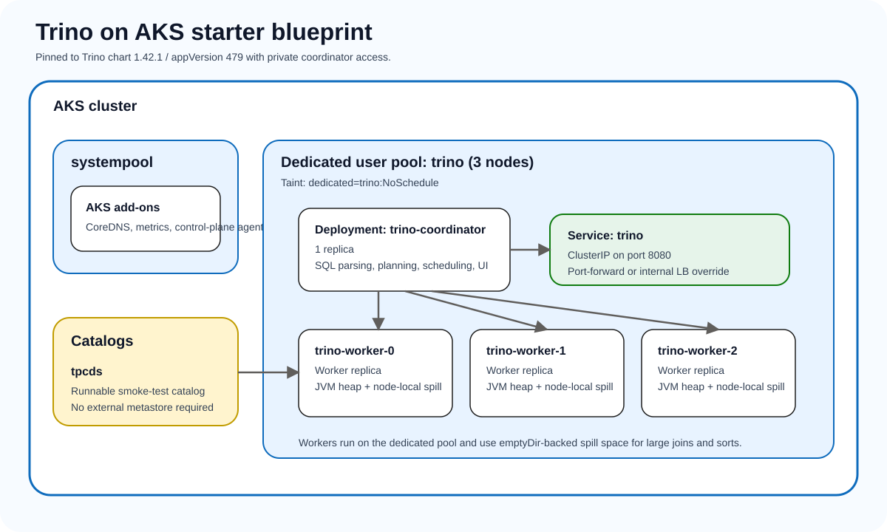

# Trino on AKS

This blueprint is the starter path for running **Trino** on AKS with AKS AVM as the infrastructure baseline.

## What this blueprint is optimizing for

- **AKS AVM baseline** for repeatable cluster creation
- **Terraform and Bicep** wrappers side by side
- **ADLS Gen2 first** as the durable lakehouse foundation for persisted Iceberg data
- **Official Trino chart `1.42.1`** pinned to **Trino `479`**
- **One dedicated `trino` user pool with 3 nodes** for coordinator and worker placement
- **One dedicated `catalog` user pool** for the Iceberg REST catalog service
- **Internal-only service exposure by default** using `ClusterIP` plus port-forward or an internal load balancer override
- **A runnable `tpcds` catalog** for generated benchmark data and an Iceberg REST path for persisted ADLS Gen2 tables

## Why this is not a typical AKS microservice

Trino uses Kubernetes `Deployment`s rather than `StatefulSet`s, but it still should not be treated like a generic stateless API service:

- the **coordinator** is a control-plane component that parses SQL, plans stages, and tracks worker health
- the **workers** do the heavy scan, join, aggregation, and exchange work for each query
- query success depends on **JVM heap sizing, query memory limits, and spill-to-disk behavior**, not only replica count
- **catalog configuration** is part of the runtime contract because Trino is only useful when its connectors and data access patterns are explicit
- worker pods need deliberate **node-local spill space** and should not share tiny system nodes with unrelated workloads

That is why this blueprint emphasizes a dedicated user pool, pinned memory settings, worker spill directories, a concrete starter catalog, and private service exposure from the start.

## Recommended starting pattern

| Layer | Recommendation | Why |
| --- | --- | --- |
| AKS baseline | Shared AVM wrapper | Keeps cluster creation consistent across workloads |
| Dedicated compute pool | `trino` user pool with 3 nodes | Separates query execution from AKS system components |
| Coordinator | 1 replica on the `trino` pool | Keeps planning and scheduling on predictable capacity |
| Workers | 3 replicas on the `trino` pool | Matches the dedicated node count and spreads query execution |
| Service exposure | `ClusterIP` by default | Keeps the SQL endpoint private |
| Catalogs | `tpcds` source plus Iceberg REST target | Generates benchmark rows first, then persists selected tables to ADLS Gen2 |
| Spill path | `emptyDir` on each worker, preferably on SSD/NVMe-capable nodes | Gives memory-intensive queries a controlled local spill target |
| Durable data | Iceberg tables on ADLS Gen2 | Stores Parquet data files plus Iceberg metadata outside the AKS node lifecycle |

## Architecture visuals

*Custom AKS mapping for this repository. It shows the coordinator and worker split, the dedicated `trino` node pool, the internal service, and the `tpcds` source catalog with an Iceberg/ADLS Gen2 persistence path.*

## Blueprint contents

- `docs/architecture.md`
- `docs/iceberg-rest-adls.md`
- `docs/tpcds-to-iceberg.md`
- `docs/portal-deployment.md`
- `docs/az-cli-deployment.md`
- `docs/operations.md`
- `infra/terraform`
- `infra/bicep`
- `kubernetes/helm`
- `kubernetes/manifests`
- `scripts/az-cli`

## Standard release names

The workload guidance assumes the Helm release name `trino`. With that name, the chart creates:

1. coordinator service `trino`
2. worker headless service `trino-worker`
3. coordinator deployment `trino-coordinator`
4. worker deployment `trino-worker`

Using the documented release name keeps the Helm values, validation commands, and blog content aligned.

## Scope of the current implementation

This blueprint now includes:

- AKS wrappers with a concrete `trino` node pool definition
- ADLS Gen2, workload identity, and Iceberg REST catalog guidance
- a pinned Helm deployment for Trino `479`
- a runnable `tpcds` catalog for generated benchmark rows
- internal-only access guidance for the coordinator service
- operator guidance for portal-first and CLI-first deployments
- a publish-ready blog package in [`blogs/trino`](../../../blogs/trino)

The starter footprint now treats `tpcds` as the source generator and Iceberg on ADLS Gen2 as the persisted target. Azure Storage access must use workload identity or managed identity-based authentication rather than shared keys.
